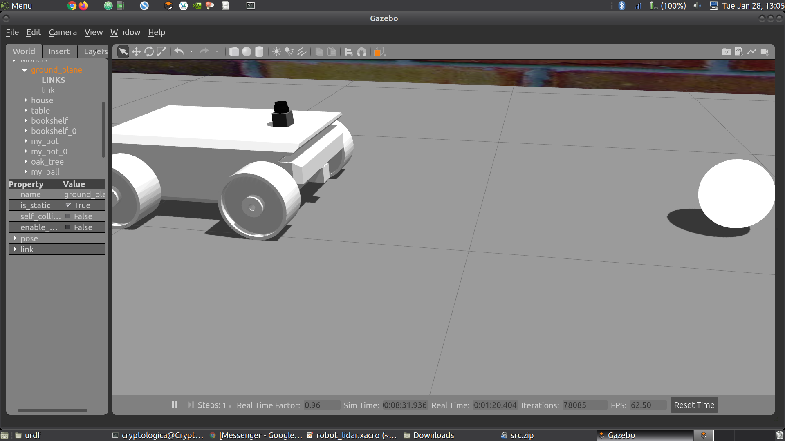

# RSD_002_GoChaseIt
This repo is my submission to Udacity's Robotic Software Developer Project 0012, entitled "Go Chase It".

In this project, we were to design a mobile robot via urdf (unified robot description format), include it within the previously designed Gazebo world, and use basic image processing to locate and track a white ball throughout the environment by automatically driving to the ball whilst it's within camera view of the robot.

The project must adhere to the [Project Rubric](https://review.udacity.com/#!/rubrics/2397/view).


## Project Description

### Summary of Tasks
In this project, you should create two ROS packages inside your ```catkin_ws/src```: the ```drive_bot``` and the ```ball_chaser```. Here are the steps to design the robot, house it inside your world, and program it to chase white-colored balls:

  1. ```drive_bot```:
    * Create a ```my_robot``` ROS package to hold your robot, the white ball, and the world.
    * Design a differential drive robot with the Unified Robot Description Format. Add two sensors to your robot: a lidar and a camera. Add Gazebo plugins for your robot’s differential drive, lidar, and camera. The robot you design should be significantly different from the one presented in the project lesson. Implement significant changes such as adjusting the color, wheel radius, and chassis dimensions
    * House your robot inside the world you built in the **Build My World** project.
    * Add a white-colored ball to your Gazebo world and save a new copy of this world.
    * The ```world.launch``` file should launch your world with the white-colored ball and your robot.
    
  2. ```ball_chaser```:
    * Create a ```ball_chaser``` ROS package to hold your C++ nodes.
    * Write a ```drive_bot``` C++ node that will provide a ```ball_chaser/command_robot``` service to drive the robot by controlling its linear x and angular z velocities. The service should publish to the wheel joints and return back the requested velocities.
    * Write a ```process_image``` C++ node that reads your robot’s camera image, analyzes it to determine the presence and position of a white ball. If a white ball exists in the image, your node should request a service via a client to drive the robot towards it.
    The ```ball_chaser.launch``` should run both the ```drive_bot``` and the ```process_image``` nodes.
    
  
For this project, I decided to use urdf files to design a 4-wheeled mobile robot implementing a skid steer controller since many/most UGVs and AGVs are, at very least, 4-wheeled.


